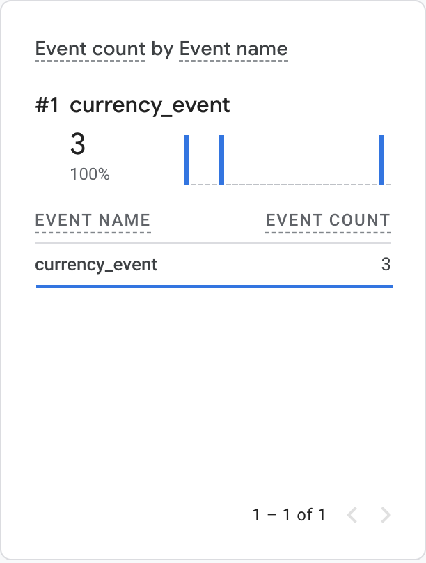
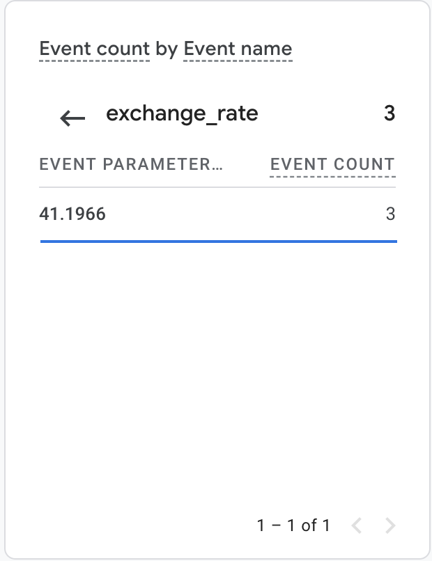

# HSA homework for GA metrics

<h3>Task</h3>

1. Create your own property [GA4](https://analytics.google.com/analytics/web)
2. Learn about [GAMP](https://developers.google.com/analytics/devguides/collection/protocol/ga4)
3. Create backend worker that will push to Google Analytics 4 info about current uah/usd ratio that can be taken from [here](https://bank.gov.ua/ua/open-data/api-dev)


Send test event:
https://ga-dev-tools.google/ga4/event-builder/

<h3>System</h3>
Scheduler pushes to GA every 5 mins custom `currency_event` with UAH/USD currency exchange rate. <br/>
Run system: <br/>

```
export GA_API_SECRET={ga-api-key}
```

```
./gradlew bootRun
```

<h3>GA configuration</h3>

Property 452920695 created: [hsa-app-ga](https://analytics.google.com/analytics/web/#/p452920695)

<h3>GA event report</h3>

